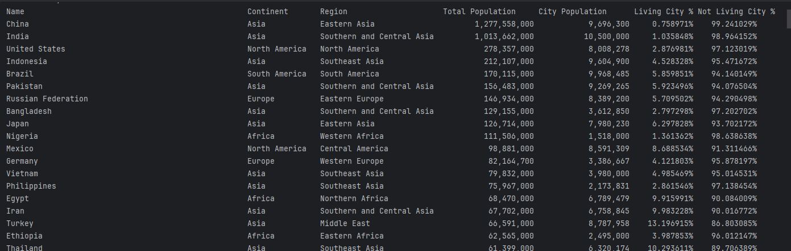
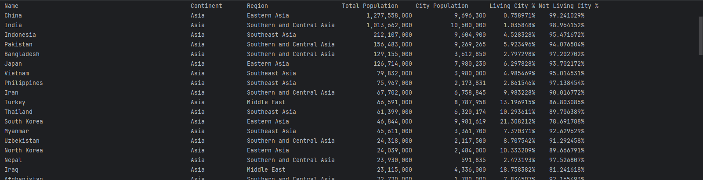
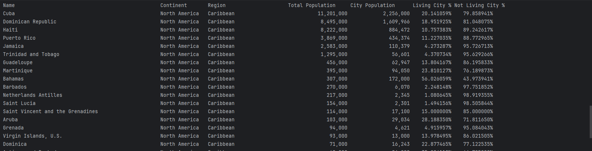
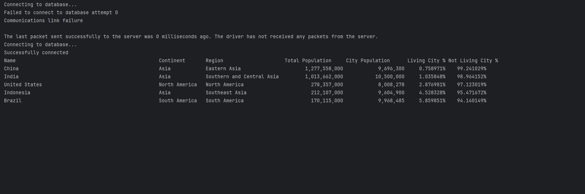

checking to see if our CI workflow is working
Just checking to see that all is working.

https://img.shields.io/github/actions/workflow/status/Otega91/sem/main.yml?branch=develop
# Software Engineering Methods
* Master Build Status 
* Develop Branch Status 
* License 
* Release 

# Main Repository Readme

## Requirements Met

4 requirements of 32 have been implemented, which is 12.5%.

## Evidence of Requirements

| ID  | Name | Met | Screenshot |
| --- | ---- | --- | ---------- |
| 1   | All the countries in the world organised by largest population to smallest. | Yes |  |
| 2   | All the countries in a continent organised by largest population to smallest. | Yes |  |
| 3   | All the countries in a region organised by largest population to smallest. | Yes |  |
| 4   | The top N populated countries in the world where N is provided by the user. | Yes |  |
| 5   | The top N populated countries in a continent where N is provided by the user. | No | |
| 6   | The top N populated countries in a region where N is provided by the user. | No | |
| 7   | All the cities in the world organised by largest population to smallest. | No | |
| 8   | All the cities in a continent organised by largest population to smallest. | No | |
| 9   | All the cities in a region organised by largest population to smallest. | No | |
| 10  | All the cities in a country organised by largest population to smallest. | No | |
| 11  | All the cities in a district organised by largest population to smallest. | No | |
| 12  | The top N populated cities in the world where N is provided by the user. | No | |
| 13  | The top N populated cities in a continent where N is provided by the user. | No | |
| 14  | The top N populated cities in a region where N is provided by the user. | No | |
| 15  | The top N populated cities in a country where N is provided by the user. | No | |
| 16  | The top N populated cities in a district where N is provided by the user. | No | |
| 17  | All the capital cities in the world organised by largest population to smallest. | No | |
| 18  | All the capital cities in a continent organised by largest population to smallest. | No | |
| 19  | All the capital cities in a region organised by largest to smallest. | No | |
| 20  | The top N populated capital cities in the world where N is provided by the user. | No | |
| 21  | The top N populated capital cities in a continent where N is provided by the user. | No | |
| 22  | The top N populated capital cities in a region where N is provided by the user. | No | |
| 23  | The population of people, people living in cities, and people not living in cities in each continent. | No | |
| 24  | The population of people, people living in cities, and people not living in cities in each region. | No | |
| 25  | The population of people, people living in cities, and people not living in cities in each country. | No | |
| 26  | The population of the world. | No | |
| 27  | The population of a continent. | No | |
| 28  | The population of a region. | No | |
| 29  | The population of a country. | No | |
| 30  | The population of a district. | No | |
| 31  | The population of a city. | No | |
| 32  | Languages from greatest number to smallest, including the percentage of the world population. | No | |